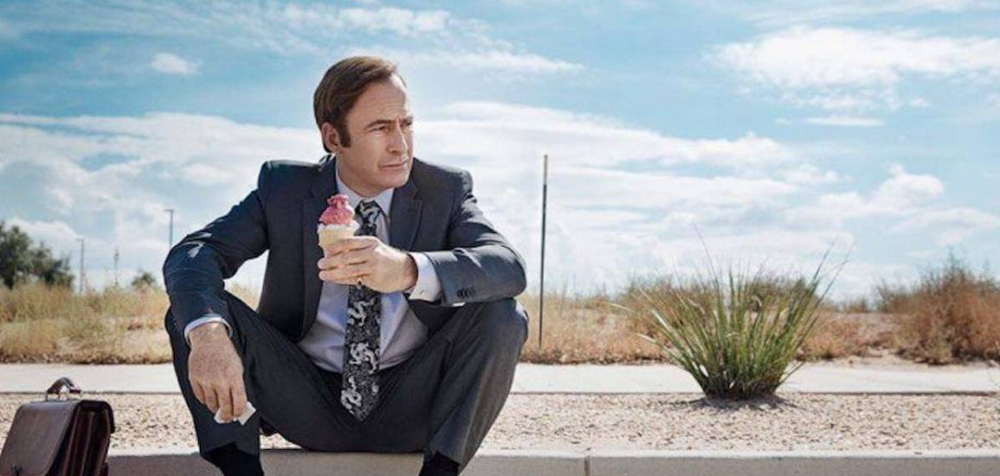
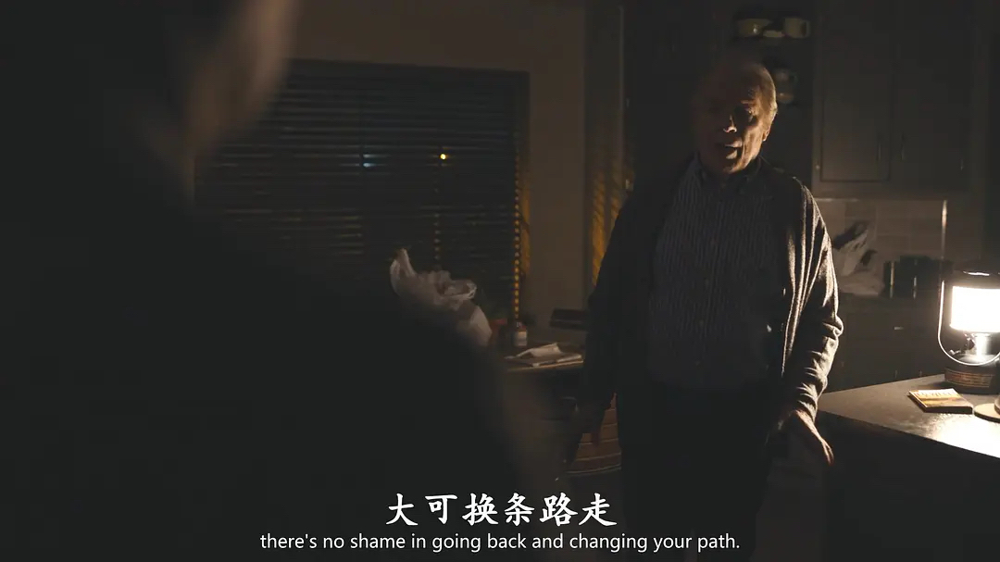

<!--more-->终于看完大结局了，但是却意犹未尽，这部 1-6 季豆瓣评分均季 9.7 的剧，完结了。心中也是五味杂陈，Jimmy 是一个善良正直的好人，然而却被各种因素一步步推向了 Saul，正如有时候睡觉被噩梦惊醒，梦里我变成了一个像 Saul 一样的人，醒了久久不能自拔，庆幸自己做的只是一个梦，带着感激过完了一天。

成为「索尔·古德曼」的吉米，戴上了职业讼棍的面具

## 叨叨

小时候我相信人是自由的，可以自主选择人生的道路；

人即将到中年整天忙于生计，路越走越窄，只剩下眼前这条小道，不得不承认人是必然存在，受客观条件制约，大部分时候根本没得选。

这是普通人人生的写照，也是《绝命毒师》主角的遭遇：

老白由于性格原因退出公司，选了个差劲的妻子，埋下种子；小粉被家庭抛弃，自甘堕落，偶然出现的天使救不了他，反而被他拖下地狱。

他们的不幸都不是偶然，命运设下的圈套环环相扣，推着他们一步一步走上绝路。

《风骚律师》延续了灰暗的现实主义风格，主角们也在命运编织的蛛网中挣扎：

吉米年轻时坑蒙拐骗，进入 HHM 后想走回正路，但查克对他成见太深，间接导致吉米被主流律师界排斥，只好向社会边缘人群提供法律服务。

后来接触到墨西哥贩毒集团，事态急转直下，半推半就成了黑金律师“索尔古德曼”。

和吉米这种非主流律师相比，金是个精干光鲜的律政精英，似乎通过努力摆脱了命运的安排，然而她童年被母亲教唆作案，破坏规则是她最大的乐趣。

金这些年小心翼翼地控制自己的反社会倾向，直到碰见玩世不恭的吉米，解放了天性，最终造成了无法挽回的后果。

看前五季时，我一直觉得吉米配不上金，第六季揭晓了谜题：

吉米游走于灰色地带，但是恪守不害人的底线；金要么不玩，玩就玩大的，为了取乐不顾后果。

其实金一直在寻找一个给她破戒台阶的人，二人中她才是社会危害性更大的那个。

吉米点火，金扇风，这段关系的结局必然是既毁灭自己也毁灭他人。

所以金才说：“you are not bad for me ,we are bad for each other”。

到 s6e12，所有明暗线都收束完毕，一切都将吉米和金引向命中注定的结局：

吉米被捕，但凭高超的谈判技巧为自己争得最轻量刑，出狱虽然不能继续当律师，但还是那个成功的犯罪掮客索尔古德曼；

金远走他乡，把自己放逐在无聊的环境里换取良心的片刻安宁，同时压抑着内心深处的反社会倾向，终有一天会再度为了找乐子而再度行骗。

这不是编剧的安排，是命运的安排，根据条件推出结论，顺理成章。

就此结束的话，《风骚律师》是和《绝命毒师》同等优秀的剧集，

两部剧的主角都没有逃出命运的掌控，逻辑统一。

然而，就在即将剧终，观众已经感叹“天意难违”时，剧情骤然转弯：

金主动向霍华德遗孀坦白了罪行，哪怕明知这会赔上她的人生；

吉米在获知这一消息后，在法庭上放弃了对他有利的控辩协议，从良知而非法律的维度审判了自己，哪怕他清楚这会让他在监狱中蹲到死。

吉米和金在蛛网中挣扎大半生，终于抓住了最后的机会，打破生活的设置，跳出命运的安排，自主选择了人生的道路。

吉米在法庭上陈述完毕后说“I’m James McGill”，此刻他抛却索尔古德曼的面具，回归自我。

这一幕简直是鲁智深圆寂的翻版“平生不修善果，只爱杀人放火。忽地顿开金绳，这里扯断玉锁。咦!钱塘江上潮信来，今日方知我是我。”

这个结局把《风骚律师》推到了比《绝命毒师》更高的层次：

前者讲了人的必然性，“人生而自由，却又无往不在枷锁之中”；

后者告诉我们，尽管人是必然存在，但仍有自由意志，“人无往不在枷锁之中，但生而自由”；

无论到什么时候，人都有选择，可以选择良知、选择爱情，选择人性中美好的部分。

而且，做出这样的选择，命运设下的金绳玉锁就再也束缚不了人。

编剧最后图穷匕见，留下一个充满希望的结局，叙事的技巧、对庞大剧情的掌控能力、思维深度都足以封神。

这个结局不仅是吉米和金最好的归宿，也是给观众最好的礼物。

看这部剧的人，也都有些年纪了，在经历社会毒打后，逐渐认命，不再坚持什么、追求什么。

《风骚律师》之于我们，本是品尝人生苦酒时的花生米，边看边慨叹“命该如此”，看剧中人物走向命定结局，观照自身感同身受。

可这个结局又给我们生出些许勇气，或许我们还有得选？

选一条艰难但正确的道路。
